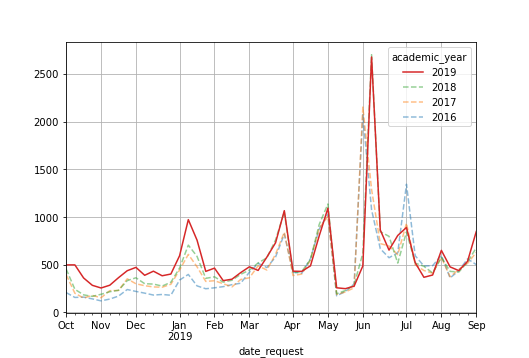
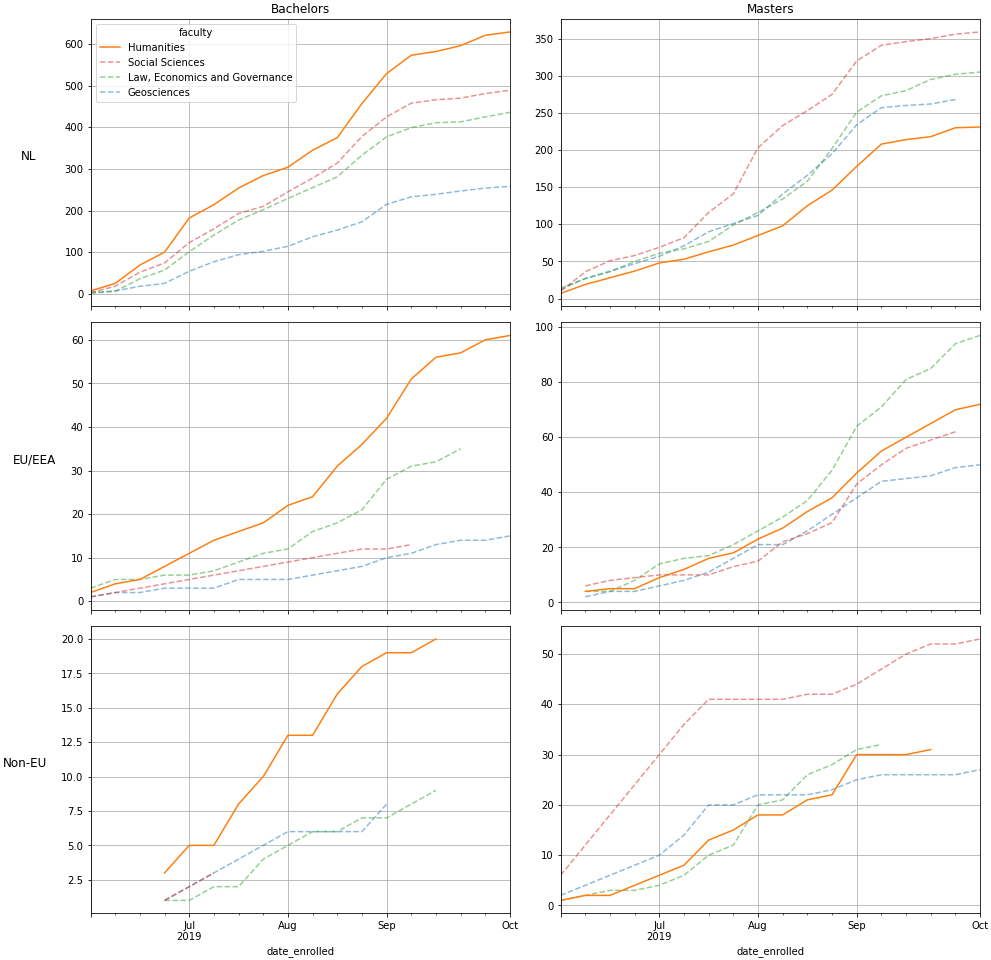

# Flatbread

## Name
Initially I planned for this library to be called pita -- short for pivot tables. But as that name was already taken on pypi.org the choice fell on flatbread.

## About
Flatbread is a library built upon pandas and matplotlib for displaying and presenting data. It is currently a work in progress. The goal is to implement the same functionalities as [pandas crosstabs](https://github.com/lcvriend/pandas_crosstabs).

## Install
To install:

```
pip install flatbread
```

## Pivot tables
Easily add subtotals to your pivot tables:

```Python
from random import randint
import pandas as pd
import flatbread as fb

df = pd._testing.makeCustomDataframe(
    nrows=8,
    ncols=4,
    data_gen_f=lambda r,c:randint(1,100),
    c_idx_nlevels=2,
    r_idx_nlevels=3,
    c_ndupe_l=[2,1],
    r_ndupe_l=[4,2,1],
)

df.pipe(fb.totals.add, axis=2, level=[0,1])
```

<table border="1" class="dataframe">
  <thead>
    <tr>
      <th></th>
      <th></th>
      <th>C0</th>
      <th colspan="3" halign="left">C_l0_g0</th>
      <th colspan="3" halign="left">C_l0_g1</th>
      <th>Total</th>
    </tr>
    <tr>
      <th></th>
      <th></th>
      <th>C1</th>
      <th>C_l1_g0</th>
      <th>C_l1_g1</th>
      <th>Subtotal</th>
      <th>C_l1_g2</th>
      <th>C_l1_g3</th>
      <th>Subtotal</th>
      <th></th>
    </tr>
    <tr>
      <th>R0</th>
      <th>R1</th>
      <th>R2</th>
      <th></th>
      <th></th>
      <th></th>
      <th></th>
      <th></th>
      <th></th>
      <th></th>
    </tr>
  </thead>
  <tbody>
    <tr>
      <th rowspan="5" valign="top">R_l0_g0</th>
      <th rowspan="2" valign="top">R_l1_g0</th>
      <th>R_l2_g0</th>
      <td align="right">77</td>
      <td align="right">1</td>
      <td align="right">78</td>
      <td align="right">59</td>
      <td align="right">40</td>
      <td align="right">99</td>
      <td align="right">177</td>
    </tr>
    <tr>
      <th>R_l2_g1</th>
      <td align="right">69</td>
      <td align="right">83</td>
      <td align="right">152</td>
      <td align="right">27</td>
      <td align="right">85</td>
      <td align="right">112</td>
      <td align="right">264</td>
    </tr>
    <tr>
      <th rowspan="2" valign="top">R_l1_g1</th>
      <th>R_l2_g2</th>
      <td align="right">18</td>
      <td align="right">9</td>
      <td align="right">27</td>
      <td align="right">72</td>
      <td align="right">52</td>
      <td align="right">124</td>
      <td align="right">151</td>
    </tr>
    <tr>
      <th>R_l2_g3</th>
      <td align="right">24</td>
      <td align="right">85</td>
      <td align="right">109</td>
      <td align="right">10</td>
      <td align="right">44</td>
      <td align="right">54</td>
      <td align="right">163</td>
    </tr>
    <tr>
      <th>Subtotal</th>
      <th></th>
      <td align="right">188</td>
      <td align="right">178</td>
      <td align="right">366</td>
      <td align="right">168</td>
      <td align="right">221</td>
      <td align="right">389</td>
      <td align="right">755</td>
    </tr>
    <tr>
      <th rowspan="5" valign="top">R_l0_g1</th>
      <th rowspan="2" valign="top">R_l1_g2</th>
      <th>R_l2_g4</th>
      <td align="right">27</td>
      <td align="right">47</td>
      <td align="right">74</td>
      <td align="right">39</td>
      <td align="right">70</td>
      <td align="right">109</td>
      <td align="right">183</td>
    </tr>
    <tr>
      <th>R_l2_g5</th>
      <td align="right">24</td>
      <td align="right">27</td>
      <td align="right">51</td>
      <td align="right">12</td>
      <td align="right">88</td>
      <td align="right">100</td>
      <td align="right">151</td>
    </tr>
    <tr>
      <th rowspan="2" valign="top">R_l1_g3</th>
      <th>R_l2_g6</th>
      <td align="right">64</td>
      <td align="right">30</td>
      <td align="right">94</td>
      <td align="right">27</td>
      <td align="right">40</td>
      <td align="right">67</td>
      <td align="right">161</td>
    </tr>
    <tr>
      <th>R_l2_g7</th>
      <td align="right">96</td>
      <td align="right">9</td>
      <td align="right">105</td>
      <td align="right">82</td>
      <td align="right">59</td>
      <td align="right">141</td>
      <td align="right">246</td>
    </tr>
    <tr>
      <th>Subtotal</th>
      <th></th>
      <td align="right">211</td>
      <td align="right">113</td>
      <td align="right">324</td>
      <td align="right">160</td>
      <td align="right">257</td>
      <td align="right">417</td>
      <td align="right">741</td>
    </tr>
    <tr>
      <th>Total</th>
      <th></th>
      <th></th>
      <td align="right">399</td>
      <td align="right">291</td>
      <td align="right">690</td>
      <td align="right">328</td>
      <td align="right">478</td>
      <td align="right">806</td>
      <td align="right">1496</td>
    </tr>
  </tbody>
</table>

Add percentages to your pivot tables:

```Python
df.pipe(fb.percs.add, level=1)
```

<table border="1" class="dataframe">
  <thead>
    <tr>
      <th></th>
      <th></th>
      <th>C0</th>
      <th colspan="4" halign="left">C_l0_g0</th>
      <th colspan="4" halign="left">C_l0_g1</th>
    </tr>
    <tr>
      <th></th>
      <th></th>
      <th>C1</th>
      <th colspan="2" halign="left">C_l1_g0</th>
      <th colspan="2" halign="left">C_l1_g1</th>
      <th colspan="2" halign="left">C_l1_g2</th>
      <th colspan="2" halign="left">C_l1_g3</th>
    </tr>
    <tr>
      <th></th>
      <th></th>
      <th></th>
      <th>abs</th>
      <th>%</th>
      <th>abs</th>
      <th>%</th>
      <th>abs</th>
      <th>%</th>
      <th>abs</th>
      <th>%</th>
    </tr>
    <tr>
      <th>R0</th>
      <th>R1</th>
      <th>R2</th>
      <th></th>
      <th></th>
      <th></th>
      <th></th>
      <th></th>
      <th></th>
      <th></th>
      <th></th>
    </tr>
  </thead>
  <tbody>
    <tr>
      <th rowspan="5" valign="top">R_l0_g0</th>
      <th rowspan="2" valign="top">R_l1_g0</th>
      <th>R_l2_g0</th>
      <td align="right">77</td>
      <td align="right">41.0</td>
      <td align="right">1</td>
      <td align="right">0.6</td>
      <td align="right">59</td>
      <td align="right">35.1</td>
      <td align="right">40</td>
      <td align="right">18.1</td>
    </tr>
    <tr>
      <th>R_l2_g1</th>
      <td align="right">69</td>
      <td align="right">36.7</td>
      <td align="right">83</td>
      <td align="right">46.6</td>
      <td align="right">27</td>
      <td align="right">16.1</td>
      <td align="right">85</td>
      <td align="right">38.5</td>
    </tr>
    <tr>
      <th rowspan="2" valign="top">R_l1_g1</th>
      <th>R_l2_g2</th>
      <td align="right">18</td>
      <td align="right">9.6</td>
      <td align="right">9</td>
      <td align="right">5.1</td>
      <td align="right">72</td>
      <td align="right">42.9</td>
      <td align="right">52</td>
      <td align="right">23.5</td>
    </tr>
    <tr>
      <th>R_l2_g3</th>
      <td align="right">24</td>
      <td align="right">12.8</td>
      <td align="right">85</td>
      <td align="right">47.8</td>
      <td align="right">10</td>
      <td align="right">6.0</td>
      <td align="right">44</td>
      <td align="right">19.9</td>
    </tr>
    <tr>
      <th>Subtotal</th>
      <th></th>
      <td align="right">188</td>
      <td align="right">100.0</td>
      <td align="right">178</td>
      <td align="right">100.0</td>
      <td align="right">168</td>
      <td align="right">100.0</td>
      <td align="right">221</td>
      <td align="right">100.0</td>
    </tr>
    <tr>
      <th rowspan="5" valign="top">R_l0_g1</th>
      <th rowspan="2" valign="top">R_l1_g2</th>
      <th>R_l2_g4</th>
      <td align="right">27</td>
      <td align="right">12.8</td>
      <td align="right">47</td>
      <td align="right">41.6</td>
      <td align="right">39</td>
      <td align="right">24.4</td>
      <td align="right">70</td>
      <td align="right">27.2</td>
    </tr>
    <tr>
      <th>R_l2_g5</th>
      <td align="right">24</td>
      <td align="right">11.4</td>
      <td align="right">27</td>
      <td align="right">23.9</td>
      <td align="right">12</td>
      <td align="right">7.5</td>
      <td align="right">88</td>
      <td align="right">34.2</td>
    </tr>
    <tr>
      <th rowspan="2" valign="top">R_l1_g3</th>
      <th>R_l2_g6</th>
      <td align="right">64</td>
      <td align="right">30.3</td>
      <td align="right">30</td>
      <td align="right">26.5</td>
      <td align="right">27</td>
      <td align="right">16.9</td>
      <td align="right">40</td>
      <td align="right">15.6</td>
    </tr>
    <tr>
      <th>R_l2_g7</th>
      <td align="right">96</td>
      <td align="right">45.5</td>
      <td align="right">9</td>
      <td align="right">8.0</td>
      <td align="right">82</td>
      <td align="right">51.2</td>
      <td align="right">59</td>
      <td align="right">23.0</td>
    </tr>
    <tr>
      <th>Subtotal</th>
      <th></th>
      <td align="right">211</td>
      <td align="right">100.0</td>
      <td align="right">113</td>
      <td align="right">100.0</td>
      <td align="right">160</td>
      <td align="right">100.0</td>
      <td align="right">257</td>
      <td align="right">100.0</td>
    </tr>
  </tbody>
</table>

## Pivot charts

Use the Trendline object to create trendlines. Compare multiple years:

```Python
tl = flatbread.TrendLine.from_df(
    df,
    year      = 2019,
    yearfield = 'academic_year',
    datefield = 'date_request',
    end       = '2019-09-01',
    period    = 'w',
    grouper   = 'academic_year',
    focus     = 2019,
)

fig = tl.plot()
tl.savefig()
```



Split your graphs in rows and columns:

```Python
tl = flatbread.TrendLine.from_df(
    sample.query(query),
    year      = 2019,
    datefield = 'date_enrolled',
    yearfield = 'academic_year',
    period    = 'w',
    end       = '2019-10-01',
    grouper   = 'faculty',
    focus     = 'Humanities',
)

fig = tl.plot(
    rows   = 'origin',
    cols   = 'exam_type',
    cum    = True,
    filter = "academic_year == 2019"
)
tl.savefig()
```


