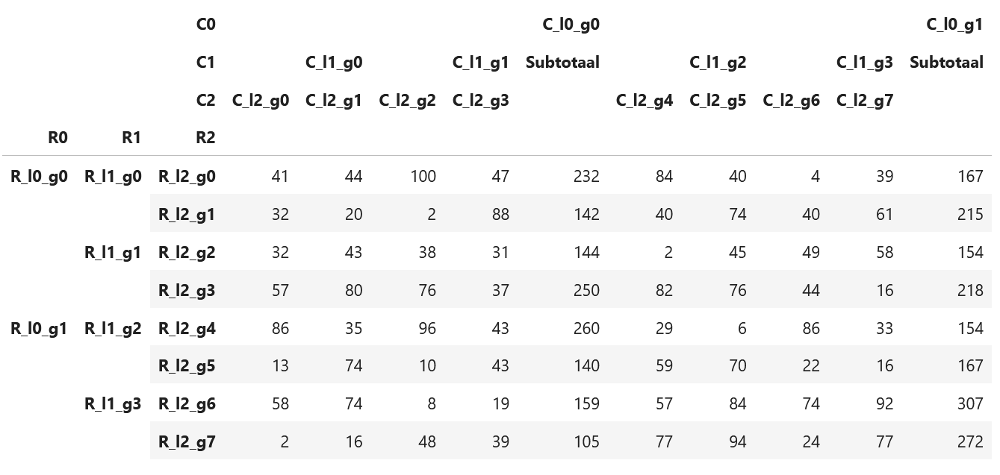
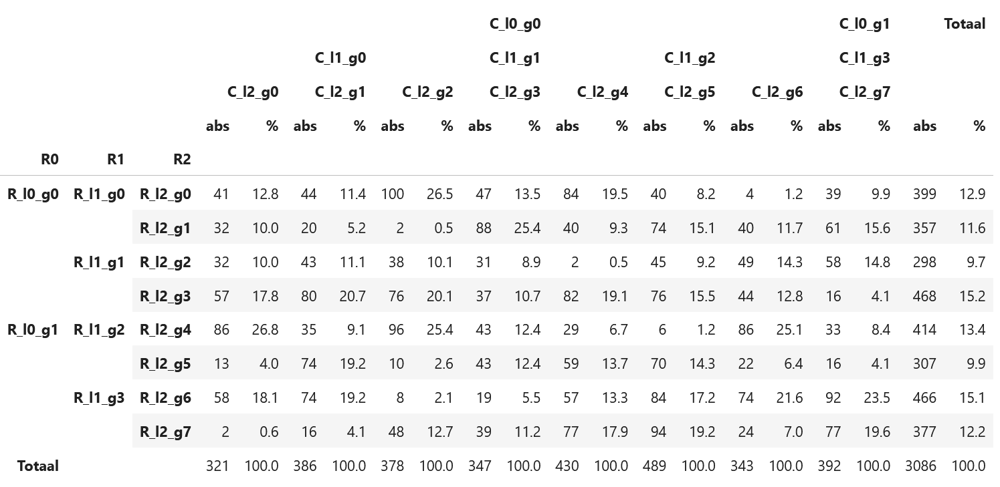

# Flatbread

## Name
Initially I planned for this library to be called pita -- short for pivot tables. But as that name was already taken on pypi.org the choice fell on flatbread.

## About
Flatbread is a library built upon pandas and matplotlib for displaying and presenting data. It is currently a work in progress. The goal is to implement the same functionalities as [pandas crosstabs](https://github.com/lcvriend/pandas_crosstabs).

## Install
To install:

```pip install flatbread```

## Pivot tables
Easily add subtotals to your pivot tables:

```Python
from random import randint
import pandas as pd
import flatbread

df = pd._testing.makeCustomDataframe(
    nrows=8,
    ncols=4,
    data_gen_f=lambda r,c:randint(1,100),
    c_idx_nlevels=3,
    r_idx_nlevels=3,
    c_ndupe_l=[4,2,1],
    r_ndupe_l=[4,2,1],
)

df.pipe(flatbread.agg.totals.add, axis=1, level=1)
```

Add percentages to your pivot tables:



```Python
df.pipe(
    flatbread.agg.totals.add, axis=2
).pipe(
    flatbread.agg.percentages.add
)
```



## Pivot charts

Use the Trendline object to create trendlines. Compare multiple years:

```Python
tl = flatbread.TrendLine.from_df(
    df,
    year      = 2019,
    yearfield = 'academic_year',
    datefield = 'date_request',
    end       = '2019-09-01',
    period    = 'w',
    grouper   = 'academic_year',
    focus     = 2019,
)

fig = tl.plot()
tl.savefig()
```


Split your graphs in rows and columns:

```Python
tl = flatbread.TrendLine.from_df(
    sample.query(query),
    year      = 2019,
    datefield = 'date_enrolled',
    yearfield = 'academic_year',
    period    = 'w',
    end       = '2019-10-01',
    grouper   = 'faculty',
    focus     = 'Humanities',
)

fig = tl.plot(
    rows   = 'origin',
    cols   = 'exam_type',
    cum    = True,
    filter = "academic_year == 2019"
)
tl.savefig()
```


