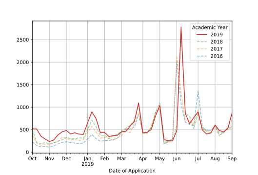
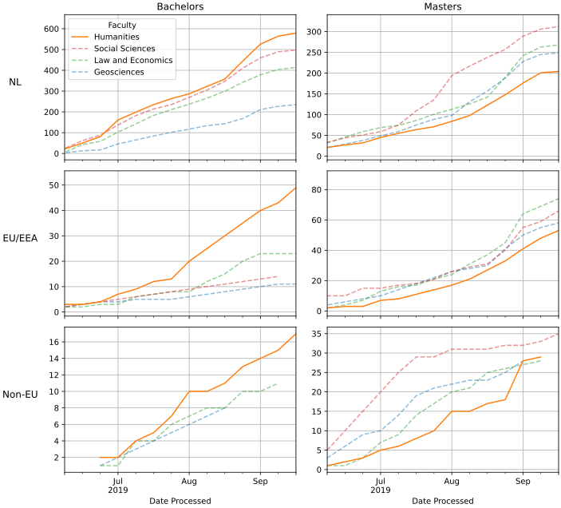

#  Flatbread 

## About
Flatbread is a small library which extends the pivot table functionality in pandas. Flatbread is accessible through the DataFrame using the `pita` accessor.


The library contains functions which will allow you to easily add **totals/subtotals** to one or more axes/levels of your pivot table. Furthermore, flatbread can calculate **percentages** from the totals/subtotals of each axis/level of your pivot table. You can transform the existing values in your table into percentages, but you can also add the percentages neatly next to your data. If the required (sub)totals are not present, then flatbread will add them automatically in order to perform the calculations. By default the (sub)totals are kept but you can drop them too. The library also contains some functionality built on top of matplotlib for plotting your data.

## Name
Initially I planned for this library to be called pita -- short for pivot tables. But as that name was already taken on pypi.org the choice fell on flatbread.

## Install
To install:

```
pip install flatbread
```

## Pivot tables
Let's create a df for testing:

```Python
from random import randint
import pandas as pd
import flatbread as fb

df = pd._testing.makeCustomDataframe(
    nrows=8,
    ncols=4,
    data_gen_f=lambda r,c:randint(1,100),
    c_idx_nlevels=2,
    r_idx_nlevels=3,
    c_ndupe_l=[2,1],
    r_ndupe_l=[4,2,1],
)
```

### Totals and subtotals
Flatbread let's you easily add subtotals to your pivot tables. Here we add totals and subtotals to both axes at once:

```
df.pipe(fb.totals.add, axis=2, level=[0,1])
```

<table border="1" class="dataframe">
  <thead>
    <tr>
      <th></th>
      <th></th>
      <th>C0</th>
      <th colspan="3" halign="left">C_l0_g0</th>
      <th colspan="3" halign="left">C_l0_g1</th>
      <th>Total</th>
    </tr>
    <tr>
      <th></th>
      <th></th>
      <th>C1</th>
      <th>C_l1_g0</th>
      <th>C_l1_g1</th>
      <th>Subtotal</th>
      <th>C_l1_g2</th>
      <th>C_l1_g3</th>
      <th>Subtotal</th>
      <th></th>
    </tr>
    <tr>
      <th>R0</th>
      <th>R1</th>
      <th>R2</th>
      <th></th>
      <th></th>
      <th></th>
      <th></th>
      <th></th>
      <th></th>
      <th></th>
    </tr>
  </thead>
  <tbody>
    <tr>
      <th rowspan="5" valign="top">R_l0_g0</th>
      <th rowspan="2" valign="top">R_l1_g0</th>
      <th>R_l2_g0</th>
      <td align="right">8</td>
      <td align="right">76</td>
      <td align="right">84</td>
      <td align="right">32</td>
      <td align="right">55</td>
      <td align="right">87</td>
      <td align="right">171</td>
    </tr>
    <tr>
      <th>R_l2_g1</th>
      <td align="right">21</td>
      <td align="right">75</td>
      <td align="right">96</td>
      <td align="right">15</td>
      <td align="right">67</td>
      <td align="right">82</td>
      <td align="right">178</td>
    </tr>
    <tr>
      <th rowspan="2" valign="top">R_l1_g1</th>
      <th>R_l2_g2</th>
      <td align="right">66</td>
      <td align="right">84</td>
      <td align="right">150</td>
      <td align="right">38</td>
      <td align="right">40</td>
      <td align="right">78</td>
      <td align="right">228</td>
    </tr>
    <tr>
      <th>R_l2_g3</th>
      <td align="right">83</td>
      <td align="right">94</td>
      <td align="right">177</td>
      <td align="right">57</td>
      <td align="right">31</td>
      <td align="right">88</td>
      <td align="right">265</td>
    </tr>
    <tr>
      <th>Subtotal</th>
      <th></th>
      <td align="right">178</td>
      <td align="right">329</td>
      <td align="right">507</td>
      <td align="right">142</td>
      <td align="right">193</td>
      <td align="right">335</td>
      <td align="right">842</td>
    </tr>
    <tr>
      <th rowspan="5" valign="top">R_l0_g1</th>
      <th rowspan="2" valign="top">R_l1_g2</th>
      <th>R_l2_g4</th>
      <td align="right">32</td>
      <td align="right">82</td>
      <td align="right">114</td>
      <td align="right">55</td>
      <td align="right">87</td>
      <td align="right">142</td>
      <td align="right">256</td>
    </tr>
    <tr>
      <th>R_l2_g5</th>
      <td align="right">68</td>
      <td align="right">22</td>
      <td align="right">90</td>
      <td align="right">100</td>
      <td align="right">70</td>
      <td align="right">170</td>
      <td align="right">260</td>
    </tr>
    <tr>
      <th rowspan="2" valign="top">R_l1_g3</th>
      <th>R_l2_g6</th>
      <td align="right">55</td>
      <td align="right">25</td>
      <td align="right">80</td>
      <td align="right">40</td>
      <td align="right">24</td>
      <td align="right">64</td>
      <td align="right">144</td>
    </tr>
    <tr>
      <th>R_l2_g7</th>
      <td align="right">12</td>
      <td align="right">80</td>
      <td align="right">92</td>
      <td align="right">31</td>
      <td align="right">79</td>
      <td align="right">110</td>
      <td align="right">202</td>
    </tr>
    <tr>
      <th>Subtotal</th>
      <th></th>
      <td align="right">167</td>
      <td align="right">209</td>
      <td align="right">376</td>
      <td align="right">226</td>
      <td align="right">260</td>
      <td align="right">486</td>
      <td align="right">862</td>
    </tr>
    <tr>
      <th>Total</th>
      <th></th>
      <th></th>
      <td align="right">345</td>
      <td align="right">538</td>
      <td align="right">883</td>
      <td align="right">368</td>
      <td align="right">453</td>
      <td align="right">821</td>
      <td align="right">1704</td>
    </tr>
  </tbody>
</table>

### Percentages from totals and subtotals
Flatbread let's you calculate the percentages of the totals or subtotals. You can either transform the data itself or add the percentages into your pivot table as separate columns. When rounding the percentages they will always add up to 100%:

```Python
df.pipe(fb.percs.add, level=1)
```

<table border="1" class="dataframe">
  <thead>
    <tr>
      <th></th>
      <th></th>
      <th>C0</th>
      <th colspan="4" halign="left">C_l0_g0</th>
      <th colspan="4" halign="left">C_l0_g1</th>
    </tr>
    <tr>
      <th></th>
      <th></th>
      <th>C1</th>
      <th colspan="2" halign="left">C_l1_g0</th>
      <th colspan="2" halign="left">C_l1_g1</th>
      <th colspan="2" halign="left">C_l1_g2</th>
      <th colspan="2" halign="left">C_l1_g3</th>
    </tr>
    <tr>
      <th></th>
      <th></th>
      <th></th>
      <th>abs</th>
      <th>%</th>
      <th>abs</th>
      <th>%</th>
      <th>abs</th>
      <th>%</th>
      <th>abs</th>
      <th>%</th>
    </tr>
    <tr>
      <th>R0</th>
      <th>R1</th>
      <th>R2</th>
      <th></th>
      <th></th>
      <th></th>
      <th></th>
      <th></th>
      <th></th>
      <th></th>
      <th></th>
    </tr>
  </thead>
  <tbody>
    <tr>
      <th rowspan="5" valign="top">R_l0_g0</th>
      <th rowspan="2" valign="top">R_l1_g0</th>
      <th>R_l2_g0</th>
      <td align="right">8</td>
      <td align="right">4.5</td>
      <td align="right">76</td>
      <td align="right">23.1</td>
      <td align="right">32</td>
      <td align="right">22.5</td>
      <td align="right">55</td>
      <td align="right">28.5</td>
    </tr>
    <tr>
      <th>R_l2_g1</th>
      <td align="right">21</td>
      <td align="right">11.8</td>
      <td align="right">75</td>
      <td align="right">22.8</td>
      <td align="right">15</td>
      <td align="right">10.6</td>
      <td align="right">67</td>
      <td align="right">34.7</td>
    </tr>
    <tr>
      <th rowspan="2" valign="top">R_l1_g1</th>
      <th>R_l2_g2</th>
      <td align="right">66</td>
      <td align="right">37.1</td>
      <td align="right">84</td>
      <td align="right">25.5</td>
      <td align="right">38</td>
      <td align="right">26.8</td>
      <td align="right">40</td>
      <td align="right">20.7</td>
    </tr>
    <tr>
      <th>R_l2_g3</th>
      <td align="right">83</td>
      <td align="right">46.6</td>
      <td align="right">94</td>
      <td align="right">28.6</td>
      <td align="right">57</td>
      <td align="right">40.1</td>
      <td align="right">31</td>
      <td align="right">16.1</td>
    </tr>
    <tr>
      <th>Subtotal</th>
      <th></th>
      <td align="right">178</td>
      <td align="right">100.0</td>
      <td align="right">329</td>
      <td align="right">100.0</td>
      <td align="right">142</td>
      <td align="right">100.0</td>
      <td align="right">193</td>
      <td align="right">100.0</td>
    </tr>
    <tr>
      <th rowspan="5" valign="top">R_l0_g1</th>
      <th rowspan="2" valign="top">R_l1_g2</th>
      <th>R_l2_g4</th>
      <td align="right">32</td>
      <td align="right">19.2</td>
      <td align="right">82</td>
      <td align="right">39.2</td>
      <td align="right">55</td>
      <td align="right">24.3</td>
      <td align="right">87</td>
      <td align="right">33.5</td>
    </tr>
    <tr>
      <th>R_l2_g5</th>
      <td align="right">68</td>
      <td align="right">40.7</td>
      <td align="right">22</td>
      <td align="right">10.6</td>
      <td align="right">100</td>
      <td align="right">44.3</td>
      <td align="right">70</td>
      <td align="right">26.9</td>
    </tr>
    <tr>
      <th rowspan="2" valign="top">R_l1_g3</th>
      <th>R_l2_g6</th>
      <td align="right">55</td>
      <td align="right">32.9</td>
      <td align="right">25</td>
      <td align="right">11.9</td>
      <td align="right">40</td>
      <td align="right">17.7</td>
      <td align="right">24</td>
      <td align="right">9.2</td>
    </tr>
    <tr>
      <th>R_l2_g7</th>
      <td align="right">12</td>
      <td align="right">7.2</td>
      <td align="right">80</td>
      <td align="right">38.3</td>
      <td align="right">31</td>
      <td align="right">13.7</td>
      <td align="right">79</td>
      <td align="right">30.4</td>
    </tr>
    <tr>
      <th>Subtotal</th>
      <th></th>
      <td align="right">167</td>
      <td align="right">100.0</td>
      <td align="right">209</td>
      <td align="right">100.0</td>
      <td align="right">226</td>
      <td align="right">100.0</td>
      <td align="right">260</td>
      <td align="right">100.0</td>
    </tr>
  </tbody>
</table>

### Localize your table formats
Flatbread provides the `format` function for rendering your pivot table according to your preferred locale. Here we use `nl-NL` as an example:

```Python
df = pd._testing.makeCustomDataframe(
    nrows=5,
    ncols=4,
    data_gen_f=lambda r,c:randint(10,1000),
)

df.pipe(fb.percs.add).pipe(fb.format)
```

<table border="1" class="dataframe">
  <thead>
    <tr>
      <th>C0</th>
      <th colspan="2" halign="left">C_l0_g0</th>
      <th colspan="2" halign="left">C_l0_g1</th>
      <th colspan="2" halign="left">C_l0_g2</th>
      <th colspan="2" halign="left">C_l0_g3</th>
    </tr>
    <tr>
      <th></th>
      <th>abs</th>
      <th>%</th>
      <th>abs</th>
      <th>%</th>
      <th>abs</th>
      <th>%</th>
      <th>abs</th>
      <th>%</th>
    </tr>
    <tr>
      <th>R0</th>
      <th></th>
      <th></th>
      <th></th>
      <th></th>
      <th></th>
      <th></th>
      <th></th>
      <th></th>
    </tr>
  </thead>
  <tbody>
    <tr>
      <th>R_l0_g0</th>
      <td align="right">702</td>
      <td align="right">23,8</td>
      <td align="right">57</td>
      <td align="right">1,7</td>
      <td align="right">579</td>
      <td align="right">23,2</td>
      <td align="right">908</td>
      <td align="right">39,6</td>
    </tr>
    <tr>
      <th>R_l0_g1</th>
      <td align="right">791</td>
      <td align="right">26,8</td>
      <td align="right">839</td>
      <td align="right">25,6</td>
      <td align="right">687</td>
      <td align="right">27,6</td>
      <td align="right">333</td>
      <td align="right">14,5</td>
    </tr>
    <tr>
      <th>R_l0_g2</th>
      <td align="right">579</td>
      <td align="right">19,6</td>
      <td align="right">777</td>
      <td align="right">23,7</td>
      <td align="right">633</td>
      <td align="right">25,4</td>
      <td align="right">553</td>
      <td align="right">24,2</td>
    </tr>
    <tr>
      <th>R_l0_g3</th>
      <td align="right">571</td>
      <td align="right">19,3</td>
      <td align="right">699</td>
      <td align="right">21,3</td>
      <td align="right">108</td>
      <td align="right">4,4</td>
      <td align="right">439</td>
      <td align="right">19,1</td>
    </tr>
    <tr>
      <th>R_l0_g4</th>
      <td align="right">310</td>
      <td align="right">10,5</td>
      <td align="right">908</td>
      <td align="right">27,7</td>
      <td align="right">484</td>
      <td align="right">19,4</td>
      <td align="right">59</td>
      <td align="right">2,6</td>
    </tr>
    <tr>
      <th>Total</th>
      <td align="right">2.953</td>
      <td align="right">100,0</td>
      <td align="right">3.280</td>
      <td align="right">100,0</td>
      <td align="right">2.491</td>
      <td align="right">100,0</td>
      <td align="right">2.292</td>
      <td align="right">100,0</td>
    </tr>
  </tbody>
</table>

### Easy configuration
Flatbread let's you control most of its behavior through key-word arguments, but it is also easy to store your settings and use them globally throughout a project:

```Python
from flatbread import CONFIG

# pick your preferred locale and set it (used with `format`)
CONFIG.format['locale'] = 'nl_NL'
CONFIG.set_locale()

# set your own labels
CONFIG.aggregation['totals_name'] = 'Totes'
CONFIG.aggregation['label_rel'] = 'pct'

# define the number of digits to round to (-1 is no rounding)
CONFIG.aggregation['ndigits] = 2

# store your configuration permanently (across sessions)
CONFIG.save()

# restore your settings to 'factory' defaults
CONFIG.factory_reset()
```

## Pivot charts

Use the Trendline object to create trendlines. Compare multiple years:

```Python
tl = fb.TrendLine.from_df(
    sample,
    offset_year = 2019,
    datefield   = 'Date of Application',
    yearfield   = 'Academic Year',
    period      = 'w',
    end         = '2019-09-01',
    grouper     = 'Academic Year',
    focus       = 2019,
)

fig = tl.plot()
```



Split your graphs in rows and columns:

```Python
tl = fb.TrendLine.from_df(
    sample,
    offset_year = 2019,
    datefield   = 'Date Processed',
    yearfield   = 'Academic Year',
    period      = 'w',
    end         = '2019-10-01',
    grouper     = 'Faculty',
    focus       = 'Humanities',
)

fig = tl.plot(
    rows   = 'Origin Country',
    cols   = 'Examination Type',
    cum    = True,
    filter = "`Academic Year` == 2019"
)
```


