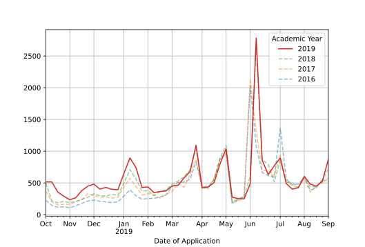

.. highlight:: python

Overview
========

Pivot tables are a great tool for exploring and presenting your data. Flatbread is a small library which extends pandas' pivot table capabilities. This functionality is accessed through the ``pita`` accessor of the DataFrame::

    df.pita(
        columns=['A', 'B'],
        index=['C', 'num_cat'],
        add_totals=True,
        axis=0,
        level=[0,1],
    ).percs(
        axis=0,
        level=0,
    )

.. raw:: html
   :file: _examples/ex1.html

What it does
------------
Flatbread adds styling, additional aggregation options and more fine-grained control over the way that missing values are handled within the pivot table.

Styling
^^^^^^^
The pivot tables viewed through flatbread have their own (customizable)
styling. This makes the view on your data clearly distinguishable from the data itself and can add to the table's readability.

Flatbread's styling uses pandas' ``Styler``. The ``style`` method will return the ``Styler`` object which then can be used to further style the table, f.e. using the pandas builtins::

    df.pita(
        columns=['A', 'B'],
        index=['C', 'D'],
    ).percs(
        axis=2,
        how='transform',
        drop_totals=True,
    ).style().background_gradient(cmap='viridis')

.. raw:: html
   :file: _examples/ex_styler_builtins.html

Aggregates
^^^^^^^^^^
Flatbread provides an easy interface to add **totals** and **subtotals** to any axis and level of your table. You can also transform your table into **percentages** or add them into the table next to your data. If the required (sub)totals are not present, then flatbread will add them automatically. By default these (sub)totals are kept in the output but can be dropped as well.

NA
^^^
Pandas' pivot table only includes records if all groupings have a value. It can
be convenient to see the NA's in your pivoted data or at least have them
factor into the aggregate calculations. Flatbread offers the option to keep the
NA's and either hide or show them in the final output.

Why the name
------------
Initially I planned for this library to be called pita -- short for pivot tables. But as that name was already taken on `pypi.org <https:/pypi.org/>`_ the choice fell on flatbread.

Installation
------------
To install::

   pip install flatbread

Pivot tables
------------
Let's create a df for testing::

   from random import randint
   import pandas as pd
   import flatbread as fb

   df = pd._testing.makeCustomDataframe(
       nrows=8,
       ncols=4,
       data_gen_f=lambda r,c:randint(1,100),
       c_idx_nlevels=2,
       r_idx_nlevels=3,
       c_ndupe_l=[2,1],
       r_ndupe_l=[4,2,1],
   )

Totals and subtotals
^^^^^^^^^^^^^^^^^^^^
Flatbread let's you easily add subtotals to your pivot tables. Here we add totals and subtotals to both axes at once::

    df.pipe(fb.totals.add, axis=2, level=[0,1])

.. raw:: html
   :file: _examples/table_ex1.html

Localize your table formats
^^^^^^^^^^^^^^^^^^^^^^^^^^^
Flatbread provides the `format` function for rendering your pivot table according to your preferred locale. Here we use `nl-NL` as an example::

    df = pd._testing.makeCustomDataframe(
        nrows=5,
        ncols=4,
        data_gen_f=lambda r,c:randint(10,1000),
    )

    df.pipe(fb.percs.add).pipe(fb.format)

.. raw:: html

    <table border="1" class="dataframe">
    <thead>
        <tr>
        <th>C0</th>
        <th colspan="2" halign="left">C_l0_g0</th>
        <th colspan="2" halign="left">C_l0_g1</th>
        <th colspan="2" halign="left">C_l0_g2</th>
        <th colspan="2" halign="left">C_l0_g3</th>
        </tr>
        <tr>
        <th></th>
        <th>abs</th>
        <th>%</th>
        <th>abs</th>
        <th>%</th>
        <th>abs</th>
        <th>%</th>
        <th>abs</th>
        <th>%</th>
        </tr>
        <tr>
        <th>R0</th>
        <th></th>
        <th></th>
        <th></th>
        <th></th>
        <th></th>
        <th></th>
        <th></th>
        <th></th>
        </tr>
    </thead>
    <tbody>
        <tr>
        <th>R_l0_g0</th>
        <td align="right">702</td>
        <td align="right">23,8</td>
        <td align="right">57</td>
        <td align="right">1,7</td>
        <td align="right">579</td>
        <td align="right">23,2</td>
        <td align="right">908</td>
        <td align="right">39,6</td>
        </tr>
        <tr>
        <th>R_l0_g1</th>
        <td align="right">791</td>
        <td align="right">26,8</td>
        <td align="right">839</td>
        <td align="right">25,6</td>
        <td align="right">687</td>
        <td align="right">27,6</td>
        <td align="right">333</td>
        <td align="right">14,5</td>
        </tr>
        <tr>
        <th>R_l0_g2</th>
        <td align="right">579</td>
        <td align="right">19,6</td>
        <td align="right">777</td>
        <td align="right">23,7</td>
        <td align="right">633</td>
        <td align="right">25,4</td>
        <td align="right">553</td>
        <td align="right">24,2</td>
        </tr>
        <tr>
        <th>R_l0_g3</th>
        <td align="right">571</td>
        <td align="right">19,3</td>
        <td align="right">699</td>
        <td align="right">21,3</td>
        <td align="right">108</td>
        <td align="right">4,4</td>
        <td align="right">439</td>
        <td align="right">19,1</td>
        </tr>
        <tr>
        <th>R_l0_g4</th>
        <td align="right">310</td>
        <td align="right">10,5</td>
        <td align="right">908</td>
        <td align="right">27,7</td>
        <td align="right">484</td>
        <td align="right">19,4</td>
        <td align="right">59</td>
        <td align="right">2,6</td>
        </tr>
        <tr>
        <th>Total</th>
        <td align="right">2.953</td>
        <td align="right">100,0</td>
        <td align="right">3.280</td>
        <td align="right">100,0</td>
        <td align="right">2.491</td>
        <td align="right">100,0</td>
        <td align="right">2.292</td>
        <td align="right">100,0</td>
        </tr>
    </tbody>
    </table>

Easy configuration
^^^^^^^^^^^^^^^^^^
Flatbread let's you control most of its behavior through key-word arguments, but it is also easy to store your settings and use them globally throughout a project::

    from flatbread import CONFIG

    # pick your preferred locale and set it (used with `format`)
    CONFIG.format['locale'] = 'nl_NL'
    CONFIG.set_locale()

    # set your own labels
    CONFIG.aggregation['totals_name'] = 'Totes'
    CONFIG.aggregation['label_rel'] = 'pct'

    # define the number of digits to round to (-1 is no rounding)
    CONFIG.aggregation['ndigits] = 2

    # store your configuration permanently (across sessions)
    CONFIG.save()

    # restore your settings to 'factory' defaults
    CONFIG.factory_reset()

Pivot charts
------------

Use the Trendline object to create trendlines. Compare multiple years::

    tl = fb.TrendLine.from_df(
        sample,
        offset_year = 2019,
        datefield   = 'Date of Application',
        yearfield   = 'Academic Year',
        period      = 'w',
        end         = '2019-09-01',
        grouper     = 'Academic Year',
        focus       = 2019,
    )

    fig = tl.plot()

Split your graphs in rows and columns::

    tl = fb.TrendLine.from_df(
        sample,
        offset_year = 2019,
        datefield   = 'Date Processed',
        yearfield   = 'Academic Year',
        period      = 'w',
        end         = '2019-10-01',
        grouper     = 'Faculty',
        focus       = 'Humanities',
    )

    fig = tl.plot(
        rows   = 'Origin Country',
        cols   = 'Examination Type',
        cum    = True,
        filter = "`Academic Year` == 2019"
    )

.. image:: _static/2020-12-22.Date_Processed.line.cum.svg
   :width: 630px
